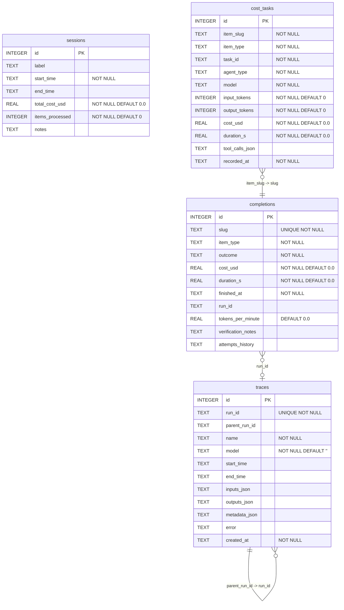

# Database Schema

The pipeline uses a single SQLite database (default: `~/.claude/orchestrator-traces.db`) managed by `TracingProxy` in `langgraph_pipeline/web/proxy.py`.

## Entity-Relationship Diagram

## Table Descriptions

### traces
Stores every LangSmith trace event emitted during pipeline execution. Traces form a tree via `parent_run_id → run_id`. Inputs, outputs, and metadata are stored as raw JSON strings.

### completions
One row per processed backlog item (identified by `slug`). Captures outcome, cost, duration, and optional verification notes after the item completes. The `attempts_history` column stores a JSON array of prior attempt records. `run_id` links back to the root trace for the item.

### cost_tasks
Granular per-task cost breakdown. Each agent invocation within an item execution writes a row here, allowing per-model and per-agent-type cost analysis. `item_slug` joins to `completions.slug`.

### sessions
Optional higher-level grouping of pipeline runs, aggregating total cost and item count across a work session. Not currently linked by foreign key — denormalized summaries only.

## Indexes

| Index | Table | Column(s) | Type |
|---|---|---|---|
| idx_traces_run_id_unique | traces | run_id | UNIQUE |
| idx_traces_parent_run_id | traces | parent_run_id | — |
| idx_traces_created_at | traces | created_at | — |
| idx_traces_model | traces | model | — |
| idx_completions_slug_unique | completions | slug | UNIQUE |
| idx_completions_finished | completions | finished_at | — |
| idx_cost_tasks_item_slug | cost_tasks | item_slug | — |

## Schema Evolution

Migrations are applied inline in `TracingProxy._init_db()` using `ALTER TABLE … ADD COLUMN` statements wrapped in try/except — silently skipped if the column already exists. There is no migration version table; idempotency is enforced by `IF NOT EXISTS` and exception handling.
